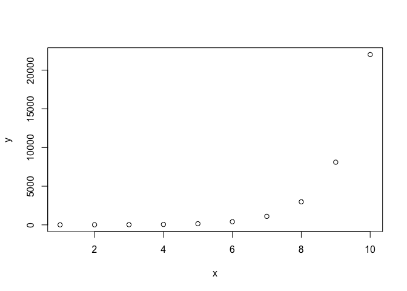

"Fundamentally learning about the world through data is really, really cool." 
-- Hadley Wickham

## Course goals

Provide an introduction to R and tools for data manipulation and statistics in R. 
This course focuses on newer R packages that have emerged over the past decade for "Data Science". 
Specific course outcomes include:

 - Using R Markdown to create reproducible results. 
 - Learn about `data.table` and its competitor the `Tidyverse`
 - Learn the basics of `ggplot2` for plotting
 - Learn the basics of date manipulation in R with `lubridate`
 - Briefly overview statistics and regression models in R 

These objectives will roughly follow Garrett Grolemund and Hadley Wickham's modeling process, which is described in their book, [R for Data Science](http://r4ds.had.co.nz/):

](http://r4ds.had.co.nz/diagrams/data-science-explore.png)

## FAQs

_What is data science?_

**Short answer:** 

A collection of approaches to help you deal with messy, large, or otherwise difficult to deal with data. 


**Long answer:** 

Data are messy.

Environmental and ecological data are no exception. 
Data science provides tools to work with difficult and messy data.
Data science combines statistics with computer science to help people understand data and apply it to decision making.
Many applied statisticians and scientists have been data scientists without realizing it because they deal with these problems on a regular basis.
In fact, the tools developed by these people serve as the foundational tools used by data scientists. 

_How is data science different from traditionaly statistcs?_

This question is up for debate. 
Many people would argue that it is not.
Others argue that data science includes more emphasis on computer science, making predictions, guiding decision making, and communicating results to non-technical audiences. 
Also, "data journalism" has emerged from data science with sites such as [FiveThirtyEight](http://fivethirtyeight.com/).

I would argue that many research scientists are already "data scientists" even if they did not know it.

_Why am I here or what will this course cover?_

I will cover some topics that I use for data science with R.
Specific topics include:

- Creating reproducible results using [R Markdown](http://rmarkdown.rstudio.com).
- Using `data.table` to manipulate data.
- Visualizing data using `ggplot2`.
- Using data to make predictions.

I will use RStudio for the course because it makes R Markdown file easy to use and so that you can follow along with this file.


_What is my experince with Data Science?_

I've been a "UseR" since 2007 when I started graduate school at Texas Tech.
After finishing my PhD in 2013, I started with the US Geological Survey where I often work with diverse and large datasets. 
Example datasets include:

- [Continental species distribution modeling that included wind turbine data](https://peerj.com/articles/2830/)
- [Telemetry data used to examine animal behavior](http://www.nrcresearchpress.com/doi/abs/10.1139/cjfas-2015-0472#.WunyadMvzc8)
- [Environmental DNA distributional data](https://onlinelibrary.wiley.com/doi/full/10.1111/1755-0998.12533)
- [Metabolimic data after toxicant exposure](https://www.sciencedirect.com/science/article/pii/S0045653516315818)
- [Tress swallow response to multiple endpoints](https://link.springer.com/article/10.1007/s10646-017-1863-7)
- [Tree swallow chromosomal damage](https://link.springer.com/article/10.1007/s10646-015-1443-7)

The tools in this course is based upon the tools I have used for these projects and others. 


_Why did you sign up for this course, or what data problems do you have?_

-
-
-


## Creating reproducilbe results

**Problem:** How do I document code so that others and myself can reproduce my results? 

**Solution:** R Markdown!

Congratulations, you're using a file generated by R Markdown now!
This document is an R Notebook, a type of R Markdown file.
R Markdown is a flavor of Markdown designed to work with R.
It was created to overcome many of the shortcomings of `Sweave`, which "weaves" S (and also R) code into LaTeX documents.
More broadly, Markdown is a computer programming "shortcut" language that takes easier to write code and complies it to HTLM.

R Markdown allows the R language to be embedded in Markdown.
This allows you to keep your code with a document for reproducible results.
I have seen theses and journal articles written in Markdown.
Also, R now allows documentation to be written in Markdown (e.g., [the vignettes for data.table](https://cran.r-project.org/web/packages/data.table/)).
Markdown also can help with "production" code that you run on a regular basis (e.g., weekly reports from chemistry instruments or statistical reports).

Here is an example of embedded code:

```r
2+2
```

```
## [1] 4
```

We can also embedded plots and not include the code in the plot:

<!-- -->
Notice the use of `<-` to assign or save an object. 
We can also use `=`. 
Two methods exist due to historical nomenclature in R. 


Next, I will open up a new R Markdown file in R Studio to demonstrate how it can be used.
Key points include:

- Basic syntax
- Code "chunks"
- Including figures
- Cheat sheets builds into [RStudio](https://rmarkdown.rstudio.com/lesson-15.html)
- Tutorials from [RStuido](https://rmarkdown.rstudio.com/)

**Downside:** Advanced formatting requires understanding CSS files and LaTeX.

### Exercise

1. Open your own RMarkdown file and compile it.
2. Create headings and subheadings.
3. Use RMarkdown to take notes for the remainder of the course.

## Import data

### Today's data

- Adult sea lamprey density
- https://www.sciencebase.gov/catalog/item/59b6cc06e4b08b1644ddf8b3
- MS Thesis looking to see if adult lamprey densities correspond to eDNA concentrations  

### Reading in data

- CSV files work best
- Possible to download directly from web
- Recommend avoiding Excel
- R has build in Data
- R Studio has point and click (avoid, easy to forget file location, version loaded in)
- Go through 3 methods 
  - Base R
  - data.table
  - Tidyverse 
  
### Reading in data


```r
adults_df <- read.csv("https://www.sciencebase.gov//catalog/file/get/59b6cc06e4b08b1644ddf8b3?f=__disk__f7%2F19%2F08%2Ff719084d841c0419e3a7f9a747c156406e32a85b")

library(data.table)
adults_dt <- fread("https://www.sciencebase.gov//catalog/file/get/59b6cc06e4b08b1644ddf8b3?f=__disk__f7%2F19%2F08%2Ff719084d841c0419e3a7f9a747c156406e32a85b")

library(tidyverse)
```

```
## ── Attaching packages ────────────────────────────────── tidyverse 1.2.1 ──
```

```
## ✔ ggplot2 3.0.0     ✔ purrr   0.2.5
## ✔ tibble  1.4.2     ✔ dplyr   0.7.6
## ✔ tidyr   0.8.1     ✔ stringr 1.3.1
## ✔ readr   1.1.1     ✔ forcats 0.3.0
```

```
## ── Conflicts ───────────────────────────────────── tidyverse_conflicts() ──
## ✖ dplyr::between()   masks data.table::between()
## ✖ dplyr::filter()    masks stats::filter()
## ✖ dplyr::first()     masks data.table::first()
## ✖ dplyr::lag()       masks stats::lag()
## ✖ dplyr::last()      masks data.table::last()
## ✖ purrr::transpose() masks data.table::transpose()
```

```r
adults_tib <- read_csv("https://www.sciencebase.gov//catalog/file/get/59b6cc06e4b08b1644ddf8b3?f=__disk__f7%2F19%2F08%2Ff719084d841c0419e3a7f9a747c156406e32a85b")
```

```
## Parsed with column specification:
## cols(
##   Sample = col_character(),
##   Fluor = col_character(),
##   Copies = col_double(),
##   Inhibited = col_character()
## )
```
### Why can't I find my own data?

- Working directory: Where R lives (reads from and save to)
- Show how to point and click in RStudio
- `setwd()`, `getwd()` 
- File paths: 
  - Same folder `read.csv("file.csv")` or `read.csv("./file.csv")`
  - Absolute `read.csv("/Path/to/file.csv")`
  - Relative `read.csv("./folder/file.csv")`
    - `./` is current folder
    - `../` is up one folder, `../../` is up 2 folders, etc. 
  
## Data structures

- Useful functions 
  - `print()`
  - `str()`, `class()`, `unclass()`
  - `dim()`, `ncol()`, `nrow()`
  - `summary()`
  - `head()`, `tail()`

**Exercise:** Test out these on the three example datasets. For example:


```r
print(adults_df)
print(adults_dt)
print(adults_tib)
```

### Other important data types

- vectors: 
  - Create: in R using concatenate or combine function: `c()`
  - Types: `numeric()`, `character()`, `integer()`
  - Change types: `as.x()` e.g,. `as.numeric()`
  - Important for plotting and regression 
- `matrix()`:
  - Only one type (e.g., all numeric or all characters)
  - Any size and dimension ranging
  - Used by some R functions and outputs 
- `data.frame()`
  - Table of vectors
  - All same length
  - Not all same type
  - `data.table()` and `tible()` are _improved_ versions of `data.frame()`
- `list()`
 - Group of objects
 - Can be different lengths
 - Can be different types

### Comparison of data.table and Tidyverse 

**Problems:** Base R lacks a consistent syntax and design. This creates problems including: 

- Base R functions are often hard to read;
- Functions often have non-intuitive syntax;
- Outputs can be clunky and difficult to work with; and
- Stringing together outputs can create difficult to read code.


**Solutions:** The data.table package or Tidyverse packages. Which one?


_Why data.table?_

- Large data
- Compact syntax

_What is data.table?_

- New version of `data.frame`
- Optimized to work with large files (100GB+)
- Simpler (albeit less transparent) syntax than R

_Alternatives is data.table?_

- Base R: Slower, harder to read
- Tidyverse: Easiest to read, does not work well with "large" data
- Python with Numpy/Pandas: Different language, slower for "large" data 

_Why Tidyvers?_

  - Easy to use and understand
  - Language within R
  - Can "pipe" together multiple functions
  
_What is Tidyverse?_

  - _The Tidyverse is an opinionated collection of R packages designed for data science. All packages share an underlying design philosophy, grammar, and data structures._
  - Hadley's opinionated version of what R should be like.  
  
_Alternatives to Tidyverse?_ 

  - Base R: Slower and harder to read
  - data.table: Harder to read although quicker.
  - Python with Panadas: Less developed and fewer tools.

_Overview of Tidyverse_

  - Core of 8 packages for everything from data manipulation to plotting
  - 10+ extra packages
  - `tibble()` replaces `data.frame()`
  - Includes two packages, `ggplot2` and `lubridate` covered later


## Data manipulaiton

### Filtering 

**Problem:** We need to separate out the two assay types and remove the negative controls. 
We want two new data.frames. One with HEX assay and one with a FAM assay. 
These also should have the negative controls removed. 

**Steps:**

1.  We want to filter by the `Flour` column. First, we can create the FAM assay data.frame. Second, we can create the HEX data.frame.
2.  We want to remove all of the negative controls.

### Useful filtering tools 

R contains many tools for filter. 
These are build upon computer logic. 
Examples include: 


```r
## Is a data entry a?
letters == "a"
## Is a data entry NOT a?
letters != "a"
## Is a data entry a or z
letters == "a" | letters == "z"
## Can also use in %in% command
letters %in% c("a", "z")
## But compare to the reverse 
c("a", "z") %in% letters
## for numbers, greather than or equal to as well
1:5 < 2
1:5 <= 2
## There is also an OR function
1:5 <= 2 | 1:5 == 4
```

#### Creating a FAM data.frame

To do this in Base R, we first filter by FAM:

```r
adults_df_FAM <- adults_df[ adults_df$Fluor == "FAM",]
```

Second, we need to remove the negative controls:  

```r
adults_df_FAM_Samples <- adults_df_FAM[ !grepl("Neg-Con", adults_df_FAM$Sample),]
```

Or, we could have done this in one step using an "and" command:

```r
adults_df_FAM_Samples2 <- adults_df[ adults_df$Fluor == "FAM" & !grepl("Neg-Con", adults_df_FAM$Sample),]
```

Doing this with data.table is similar to the above commands, but we do not need to explicit call the columns:


```r
adults_dt_FAM_Samples <- adults_dt[ Fluor == "FAM" & !grepl("Neg-Con", Sample),]
```

Conversely, Tidyverse allows us to do the multiple steps in an easy to read syntax.
First, we specify our `tibble`. 
Then we use the pipe command `%>%` to say we want to continue on to another function.
Second, we  use `filter()` twice. 


```r
adults_tib_FAM_Samples <-  adults_tib %>% 
  filter(Fluor == "FAM") %>%
  filter(!grepl("Neg-Con", Sample)) 
```

#### Exercises

- Which syntax seems easiest for your to read?
- Repeat the above exercise extracting `HEX` rather than `FAM`.

***Course note:** For the rest of the course, I will only be using the Tidyverse and `data.table`. 
`data.table` is more concise, but terse (e.g., think about a person on the street in Manhattan).
Tidyverse is easier to use, but slightly less efficient (e.g., think about a search engine company based in Palo Alto, CA). 

### More data formatting 

We often want to summarize data 

#### Basics of data.table

The underlying theory behind data.table is inspired by SQL.
Guiding ideas include:

1. Uses `dt[, col]` syntax, similar to matrix rather than `df$col`


```
##      Fluor  Copies
##   1:   FAM 1336000
##   2:   FAM 1099000
##   3:   FAM 1229000
##   4:   FAM 1827000
##   5:   FAM 1758000
##  ---              
## 348:   HEX      NA
## 349:   HEX      NA
## 350:   HEX      NA
## 351:   HEX      NA
## 352:   HEX      NA
```

2. `i`,`j`, `by` syntax:
  - `i` is the row or what we are working on
  - `j` is the column or what we are doing
  - `by` is how to group or subset our data
  - `.()` is a shortcut for `list()`
  - `.N` gives count


```
##    Fluor       V1
## 1:   FAM 470533.1
## 2:   HEX 313486.0
```

```
##    Fluor meanCopies   N
## 1:   FAM   470533.1 176
## 2:   HEX   313486.0 176
```

```
##    Fluor Copies > 100   meanCopies   N
## 1:   FAM         TRUE 5.452901e+05 107
## 2:   FAM           NA          NaN  52
## 3:   FAM        FALSE 3.438007e+00  17
## 4:   HEX         TRUE 3.632919e+05 107
## 5:   HEX           NA          NaN  52
## 6:   HEX        FALSE 1.504079e+00  17
```


3. Wide versus long data: `melt` and `dcast`
  
  - Wide data:
  

```r
dt <- data.table(Dose = c("low", "medium", "high"), 
                 Rep1 = rbinom(n = 3, size = 6, 0.5),
                 Rep2 = rbinom(n = 3, size = 6, 0.5),
                 Rep3 = rbinom(n = 3, size = 6, 0.5))
print(dt)
```

```
##      Dose Rep1 Rep2 Rep3
## 1:    low    3    4    2
## 2: medium    4    2    4
## 3:   high    1    4    1
```
  - Long data
  

```r
dtLong <- melt(dt, id.vars = c("Dose"), variable.name = "Replicate", value.name = "Response")
print(dtLong)
```

```
##      Dose Replicate Response
## 1:    low      Rep1        3
## 2: medium      Rep1        4
## 3:   high      Rep1        1
## 4:    low      Rep2        4
## 5: medium      Rep2        2
## 6:   high      Rep2        4
## 7:    low      Rep3        2
## 8: medium      Rep3        4
## 9:   high      Rep3        1
```
  - Converting back and forth

```r
dt <- data.table(Dose = c("low", "medium", "high"), 
                 Rep1 = rbinom(n = 3, size = 6, 0.5),
                 Rep2 = rbinom(n = 3, size = 6, 0.5),
                 Rep3 = rbinom(n = 3, size = 6, 0.5))
dtLong <- melt(dt, id.vars = c("Dose"), variable.name = "Replicate", value.name = "Response")
dtWide <- dcast(dtLong, Dose ~ Replicate)
```

```
## Using 'Response' as value column. Use 'value.var' to override
```

4. Merging data.tables
   - Unique keys: `setkey()`
   - Use square brackets: `[]`
   

```r
# Create dummy data
a <- data.table(ID = 1:3, A = letters[1:3])
b <- data.table(ID = 1:3, B = LETTERS[1:3])
# Set keys
setkey(a, "ID")
setkey(b, "ID")
# merge a first
a[b]
```

```
##    ID A B
## 1:  1 a A
## 2:  2 b B
## 3:  3 c C
```

```r
# merge b first
b[a]
```

```
##    ID B A
## 1:  1 A a
## 2:  2 B b
## 3:  3 C c
```

   - `allow.cartesian = TRUE`: A precautionary measure to avoid creating too large of data.tables. See this post on [StackOverflow](https://stackoverflow.com/questions/23087358/why-is-allow-cartesian-required-at-times-when-when-joining-data-tables-with-dupl?utm_medium=organic&utm_source=google_rich_qa&utm_campaign=google_rich_qa) by the package co-authors.  
   

```r
DT1 <- data.table(x=rep(letters[1:2], c(1e1, 1e3)), 
                  y=1L, key="x")
DT2 <- data.table(x=rep("b", 3), key="x")
DT3 <- DT1[DT2] 
DT3 <- DT1[DT2, allow.cartesian = TRUE] 
```
   - multiple unique keys, also notice that keys do not need to have the same names:


```r
first = data.table(Day = rep(1:3, 2), Sample = rep(1:2, each = 3), endpoint = 1:6)
second = data.table(Day = rep(1:3, 2), Observer = rep(1:2, each = 3), cause = 11:16)
setkey(first, "Day", "Sample")
setkey(second, "Day", "Observer")
third <- first[second]
```
  - Time joins possible with rolling joins, if times do not match up. I have not used this and do not understand it. I simply know that it exists.

#### Basics of Tibbles

The underlying theory behind Tibble is inspired by SQL as well as Hadley's view of literate programing.
Guiding ideas include:

1. Function like `select()` to select columns rather than `df$col`


```
## # A tibble: 352 x 2
##    Fluor  Copies
##    <chr>   <dbl>
##  1 FAM   1336000
##  2 FAM   1099000
##  3 FAM   1229000
##  4 FAM   1827000
##  5 FAM   1758000
##  6 FAM   1543000
##  7 FAM        NA
##  8 FAM        NA
##  9 FAM        NA
## 10 FAM        NA
## # ... with 342 more rows
```

2. `summarize` in Tidyverse


```
## # A tibble: 2 x 2
##   Fluor `mean(Copies, na.rm = TRUE)`
##   <chr>                        <dbl>
## 1 FAM                        470533.
## 2 HEX                        313486.
```

```
## # A tibble: 2 x 3
##   Fluor meanCopies     N
##   <chr>      <dbl> <int>
## 1 FAM      470533.   176
## 2 HEX      313486.   176
```

```
## # A tibble: 6 x 4
## # Groups:   Fluor [?]
##   Fluor `Copies > 100` meanCopies     N
##   <chr> <lgl>               <dbl> <int>
## 1 FAM   FALSE                3.44    17
## 2 FAM   TRUE            545290.     107
## 3 FAM   NA                 NaN       52
## 4 HEX   FALSE                1.50    17
## 5 HEX   TRUE            363292.     107
## 6 HEX   NA                 NaN       52
```

3. Wide versus long data: `gather` and `spread`
  
  - Wide data:
  

```r
tib <- tibble(Dose = c("low", "medium", "high"), 
            Rep1 = rbinom(n = 3, size = 6, 0.5),
            Rep2 = rbinom(n = 3, size = 6, 0.5),
            Rep3 = rbinom(n = 3, size = 6, 0.5))
print(tib)
```

```
## # A tibble: 3 x 4
##   Dose    Rep1  Rep2  Rep3
##   <chr>  <int> <int> <int>
## 1 low        2     2     3
## 2 medium     2     3     1
## 3 high       2     3     3
```
  - Long data
  

```r
tibLong <- tib %>%
  gather( Response, value = "Replicate", Rep1, Rep2, Rep3, - Dose)

print(tibLong)
```

```
## # A tibble: 9 x 3
##   Dose   Response Replicate
##   <chr>  <chr>        <int>
## 1 low    Rep1             2
## 2 medium Rep1             2
## 3 high   Rep1             2
## 4 low    Rep2             2
## 5 medium Rep2             3
## 6 high   Rep2             3
## 7 low    Rep3             3
## 8 medium Rep3             1
## 9 high   Rep3             3
```
  - Converting back and forth

```r
tibWide <- tibLong %>% 
  spread(key = "Dose", value = "Replicate")
print(tibWide)
```

```
## # A tibble: 3 x 4
##   Response  high   low medium
##   <chr>    <int> <int>  <int>
## 1 Rep1         2     2      2
## 2 Rep2         3     2      3
## 3 Rep3         3     3      1
```

4. Merging tibbls 
  - `inner_join()`
  - `full_join()`

   

```r
# Create dummy data
a <- tibble(ID = 1:3, A = letters[1:3])
b <- tibble(ID = 1:3, B = LETTERS[1:3])

## Do a left join
a %>% 
  inner_join(b, by = "ID")
```

```
## # A tibble: 3 x 3
##      ID A     B    
##   <int> <chr> <chr>
## 1     1 a     A    
## 2     2 b     B    
## 3     3 c     C
```

```r
## Try the reverse
b %>% 
  inner_join(a, by = "ID")
```

```
## # A tibble: 3 x 3
##      ID B     A    
##   <int> <chr> <chr>
## 1     1 A     a    
## 2     2 B     b    
## 3     3 C     c
```

```r
## How to use different IDs
b %>% 
  inner_join(a, by = c("ID" = "ID"))
```

```
## # A tibble: 3 x 3
##      ID B     A    
##   <int> <chr> <chr>
## 1     1 A     a    
## 2     2 B     b    
## 3     3 C     c
```


```r
tib1 <- tibble(x=rep(letters[1:2], c(2, 3)), 
               y=1L)
tib2 <- tibble(x2 =rep("b", 3),
               z = 123)

## Compare inner and full joins as well as anti join
tib1 %>%
  inner_join(tib2, by = c("x" = "x2"))

tib1 %>%
  full_join(tib2, by = c("x" = "x2"))

tib1 %>%
  anti_join(tib2, by = c("x" = "x2"))
```
   - multiple unique keys, also notice that keys do not need to have the same names:


```r
first  <- tibble(Day = rep(1:3, 2), Sample = rep(1:2, each = 3), endpoint = 1:6)
second <- tibble(Day = rep(1:3, 2), Observer = rep(1:2, each = 3), cause = 11:16)

third <- first %>%
  inner_join(second, by = c("Day" = "Day", "Sample" = "Observer"))
  
print(third)
```

```
## # A tibble: 6 x 4
##     Day Sample endpoint cause
##   <int>  <int>    <int> <int>
## 1     1      1        1    11
## 2     2      1        2    12
## 3     3      1        3    13
## 4     1      2        4    14
## 5     2      2        5    15
## 6     3      2        6    16
```

## Seeing data with ggplot2

"What is a graphic? How can we succinctly describe a graphic? And how can we create the graphic that we have described?"
-- Hadley Wickham (2010)

**Problem:** Base R's graphics lack a coherent syntax, which limits our ability to explore data with them.

**Solution:** "Graphics of grammar" as implemented in the ggplot2 package.

Base R uses a _pen-and-paper_ philosophy, which means we add things to a plot one command at a time. 
ggplot2 uses its own language to build a plot before plotting.
This makes ggplot2 harder to use until you learns its syntax. 

### Base ggplot2 syntax

`ggplot2` is based upon theory presented in Leland Wilkinson's "Grammar of Graphics".
This underlying syntax give it power, but makes it hard to learn.
Note that, like in English, it is possible to write syntactically correct, but gibberish text (e.g., "The boat ran to the sky.").
Here is a list of some of the important parts of the syntax:

- **aesthetics** are properties of the graphic and are abbreviated **aes**. These include:
    - `position` (`x` and `y`)
    - `color` (of the border of an object)
    - `fill` (of a solid object such as polygon)
    - `shape`
    - `size`
    - `alpha` is the transparency of an object and may require the `scales` package
- **geometries** are how the data are plotted and are abbreviated **geom**. These include:
    - `point` plots points
    - `line` plots a line that connects points by order of `x`
    - `path` plots a line that connects points by order of in the `data.frame`
    - `jitter` plots points that are jittered (i.e., not on top of each other)
    - `histogram` plots a histogram of the data
    - `bar` plots a bar graph
    - `boxplot` plots a boxplot of the data
    - `smooth` plots a smoothed line (e.g., gam, loess, lm) to the data
    - `polygon` connects the dots to plot a polygon
    - `ribbon` shades the area between two lines
    - `density` plots a density plot
    - `abline` uses a `slope` and `intercept` to plot a line
- **statistics** may also be plotted are abbreviated **stat** 
- Data may be split by **facet**s
- Subplots may also be **wrap**ped  (similar to faceting, but only one variable)

The implementation of `ggplot2` in `R` requires a base object, `ggplot()` that may be an empty function. 
However, anything added to this does not need to be set elsewhere.
This will make more sense when we start with the code.

### A simple plot: One piece at a time

Does a relationship exist between ozone and temperature? 
Here, we'll walk through plotting a dataset to examine this question with these steps:

- Load the `airquality` dataset
- Remove missing values
- Create a simple plot
- Add things to the plot


```r
library(ggplot2)
data(airquality)

## Remove missing values
d <- airquality[ complete.cases(airquality), ]

## Create simple plot
ggplot(data = d, aes(x = Temp, y = Ozone)) + geom_point()

## which could also be created this way
ggplot() + geom_point(data = d, aes(x = Temp, y = Ozone))

## But does wind have an effect on ozone as well?
ggplot(data = d, aes(x = Temp, y = Ozone, color = Wind)) + geom_point()

## This hard for me to see, so let's improve it
ggplot(data = d, aes(x = Temp, y = Ozone, color = Wind)) +
                          geom_point(size = 4) +
                          scale_colour_gradient(low = "skyblue", high = "navyblue")

## Based upon this plot, do we think wind might affect ozone?
## Let's plot it.
ggplot(data = d, aes(x = Wind, y = Ozone)) + geom_point()

## How about Solar Radiation? 
ggplot(data = d, aes(x = Temp, y = Ozone, 
        color = Wind, size = Solar.R)) + geom_point() +
        scale_colour_gradient(low = "skyblue", high = "navyblue")

ggplot(data = d, aes(x = Solar.R, y = Ozone)) + geom_point()
```

### Subgroupings

Many options are available for breaking out groups with `ggplot2`.
Deciding how to break your dataset into subgroups can be tricky, but is very useful for visualizing data.
Often times, I try something, tinker with it, and try something else until I end up with a plot that makes sense. 
Here is a rough formula of what I would do:


- Decide what is my response variable or variables of interest (e.g., `x`s and `y`s). If I only have 1 continuous variable, decide what is the second most important variable.
- Plot a simple x and y point plot
- Start breaking things down by color, shape, facet, etc.
- Look at marginal plots (e.g., pooling all of the subgroupings for all parameters other than one).


Here is an example from the USFWS, USGS, and U of Minnesota researchers.
The data is from Minnesota and looks at wolf depredations.
Here's how I would start to examine it (as a quantitative person, I'm often handed datasets and asked to explain what is going on without a strong sense of why I'm looking at it): 


```r
library(ggplot2)
library(reshape2)
library(scales)
library(car) # load package with dataset
data(Depredations)
head(Depredations)

ggplot(data = Depredations, aes(x = number)) + 
    geom_histogram()

## Note, we a message about binwidth. This can be important for histograms because it 
## can change how we view the data. Let's see what happens if we change it:
ggplot(data = Depredations, aes(x = number)) + 
    geom_histogram(binwidth = 5)

ggplot(data = Depredations, aes(x = number)) + 
    geom_histogram(binwidth = 10)

ggplot(data = Depredations, aes(x = number)) + 
    geom_histogram(binwidth = 20)

## How do the figures change? 

## Now, we need to "melt" the data so that we may plot it with ggplot    
d2 <- melt(Depredations, id.vars = c("longitude", "latitude"),
           measure.vars = c("late", "early"), value.name = "kills",
           variable.name = "time") 
head(d2)
summary(d2)

## Let's talk a stab at plotting this
ggplot(data = d2, aes(x = kills, fill = time)) + 
    stat_density() +
    scale_fill_manual(values = alpha(c("blue", "red"), 0.25))

## But notice the data includes a lot of zeros. What if we remove them? 
ggplot(data = d2[ d2$kills > 0,], aes(x = kills, fill = time)) + 
    stat_density() +
    scale_fill_manual(values = alpha(c("blue", "red"), 0.25))

## Let's look at a boxplot
ggplot(data = d2, aes(y = kills, x = time)) + 
	geom_boxplot()

## With the points "jittered" on top:
ggplot(data = d2, aes(y = kills, x = time)) + 
	geom_boxplot() + geom_jitter()

## and now the non-zero events only
ggplot(data = d2[ d2$kills > 0,], aes(y = kills, x = time)) + 
	geom_boxplot()

## Let's create a non-zero data frame 
d3 <- d2[ d2$kills > 0, ]
ggplot(d3, aes(x = longitude, y = latitude, color = kills)) +
    geom_point()

## Now, let;s make spatial plot and examine scaling the data

ggplot(d3, aes(x = longitude, y = latitude, color = kills)) +
    geom_point() +
    scale_color_gradient(low = "skyblue", high = "navyblue", 
                         trans = "sqrt")   

ggplot(d3, aes(x = longitude, y = latitude, color = kills)) +
    geom_point() +
    scale_color_gradient(low = "skyblue", high = "navyblue", 
                         trans = "sqrt") + 
    facet_grid( ~ time) 

ggplot(d3, aes(x = longitude, y = latitude)) +
    stat_density2d() + geom_point() +
    facet_grid( ~ time) 


ggplot(d3, aes(x = longitude, y = latitude)) +
    stat_density2d(aes(fill = ..level..), geom="polygon") + 
    geom_point() +
    facet_grid( ~ time)

## Clean up for publication quality figure
d3$time2 <- d3$time  
levels(d3$time2) <- c("Post-1991", "Pre-1991") 
head(d3)
d3$time2 <- factor(d3$time2, levels = levels(d3$time2)[c(2, 1)])
head(d3)
levels(d3$time2)

finalWolf <- 
    ggplot(d3, aes(x = longitude, y = latitude)) +
    stat_density2d(aes(fill = ..level..), geom="polygon") + 
    geom_point() +
    facet_grid( ~ time2) + 
    theme_bw() +
    ylab(expression("Latitude ("*degree*"N)")) +
    xlab(expression("Longitude ("*degree*"W)")) +
    scale_fill_gradient("Relative\nPredation\nDensity",
                        low = "skyblue", high = "navyblue", 
                         trans = "sqrt") + 
    theme(
          strip.background = element_rect(colour = NA, fill = NA),
          panel.border = element_rect(colour = "black")
          )
print(finalWolf)
```


Note that we may also "save" a plot to an object in `R` and add to it that way as well:


```r
p <- ggplot(data = d, aes(x = Temp, y = Ozone, 
        color = Wind, size = Solar.R)) + geom_point() 
print(p)
print(p + scale_color_gradient(low = "skyblue", high = "navyblue"))
```


### Trends

Often times, we are interested in looking for trends in data.
For example, do chicks increase in weight?
Does this this increase in weight depend upon the feed type?
Or, we may be interested in the relationship between two variables.
Here is an example of how I would explore the classic "ChickWeight" dataset.


```r
data(ChickWeight)
head(ChickWeight)
summary(ChickWeight)

ggplot(data = ChickWeight, 
        aes(x = as.factor(Diet), y = weight)) +
        geom_boxplot()

ggplot(data = ChickWeight, 
        aes(x = Time, y = weight)) +
        geom_point()

ggplot(data = ChickWeight, 
        aes(x = Time, y = weight, group = Chick)) +
        geom_line()

ggplot(data = ChickWeight, 
        aes(x = Time, y = weight, group = Chick, color = Diet)) +
        geom_line()

ggplot(data = ChickWeight, 
        aes(x = Time, y = weight, color = Diet, fill = Diet)) + 
        geom_point()  + stat_smooth()

ggplot(data = ChickWeight, 
        aes(x = Time, y = weight, color = Diet, fill = Diet)) + 
        geom_point()  + stat_smooth(method = "lm")

ggplot(data = ChickWeight, 
        aes(x = Time, y = weight)) + 
        geom_point()  + stat_smooth(method = "lm") +
        facet_grid( . ~ Diet)

summary(lm(weight ~ Time * Diet, data = ChickWeight))
```

### ggmap example 


```r
## Load libraries and data
library(ggplot2)
library(ggmap)
library(reshape2)
library(car) # load package with dataset
data(Depredations)

library(ggsn)

## Cleanupd data
head(Depredations)

 d2 <- melt(Depredations, id.vars = c("longitude", "latitude"),
measure.vars = c("late", "early"), value.name = "kills",
variable.name = "time")
 d3 <- d2[ d2$kills > 0, ]
  d3$time2 <- d3$time
levels(d3$time2) <- c("Post-1991", "Pre-1991")
head(d3)
d3$time2 <- factor(d3$time2, levels = levels(d3$time2)[c(2, 1)])
head(d3)
levels(d3$time2)
 
 ## Old plot
finalWolf <-
ggplot(d3, aes(x = longitude, y = latitude)) +
	stat_density2d(aes(fill = ..level..), geom="polygon") +
	geom_point() +
	facet_grid( ~ time2) +
	theme_bw() +
ylab(expression("Latitude ("*degree*"N)")) +
xlab(expression("Longitude ("*degree*"W)")) +
scale_fill_gradient("Relative\nPredation\nDensity",
low = "skyblue", high = "navyblue",
trans = "sqrt") +
 theme(
strip.background = element_rect(colour = NA, fill = NA),
panel.border = element_rect(colour = "black")
)
print(finalWolf)

## Explore ggmap 
mn9 <- get_map(location = "Minnesota ", zoom = 9)
mn8 <- get_map(location = "Minnesota ", zoom = 8)
mn7 <- get_map(location = "Minnesota ", zoom = 7)
mn6 <- get_map(location = "Minnesota ", zoom = 6)

ggmap(mn9) + geom_point(data = d3, aes(x = longitude, y = latitude))
ggmap(mn8) + geom_point(data = d3, aes(x = longitude, y = latitude))
ggmap(mn7) + geom_point(data = d3, aes(x = longitude, y = latitude))
ggmap(mn6) +  geom_point(data = d3, aes(x = longitude, y = latitude))

## Make pub quality 

newPlot <- ggmap(mn6) +  
	stat_density2d(data = d3, aes(x = longitude, y = latitude, fill = ..level..), geom="polygon") +
	geom_point(data = d3, aes(x = longitude, y = latitude)) +
	facet_grid(~ time2) +
	theme_bw() +
	ylab(expression("Latitude ("*degree*"N)")) +
	xlab(expression("Longitude ("*degree*"W)")) +
	scale_fill_gradient("Relative\nPredation\nDensity",
									low = "skyblue", high = "navyblue",
									trans = "sqrt") +
	theme(
		strip.background = element_rect(colour = NA, fill = NA),
		panel.border = element_rect(colour = "black")
	) +
	scale_x_continuous(limits = c(-97.5, -89), expand = c(0, 0)) +
  
       scale_y_continuous(limits = c(43, 49.5), expand = c(0, 0)) +
       north2()
print(newPlot)
```

### Publication quality figures

- You'll often times need to change a `factor`'s order like we did in the wolf example for either facets or discrete variables.
- The `theme_options()` has useful attributes
- `ggplot2` has themes, the default has a gray background, the `theme_bw` often looks better, but it is personal taste. I also like `theme_minimal`
- `ggthemes` package has some themes
- The `scale` function is helpful, e.g.: `scale_color_discrete` or `scale_fill_continuous` which can also be used with shapes, linetype, etc.
- Use `ggsave` to save your plot.
- If absolutely necessary, touch up your graphic with another program such as Inkscape (if you are a student, I would recommend getting Adobe Illustrator. Adobe Illustrator seems to place nicer with `ggplot2` figures).

### Where to go for more ggplot2 help?

For plotting, I oftentimes browse online to find a plot I like. 
Then I take it, adapt the code, and make it my own.
Last, I save the code for later and repeat.

- `ggplot2` book by Wickham. There is now a second edition out. 
- Google is your friend.
- _R Cookbook_ online: http://www.cookbook-r.com/
- `ggplot2` documentation online 
- `ggplot2` mailing list
- `stackoverflow.com` 

## lubridate

Dates were hard to work with R. 
The lubridate packages makes them much, much easier.


```r
library(lubridate)
```

```
## 
## Attaching package: 'lubridate'
```

```
## The following objects are masked from 'package:data.table':
## 
##     hour, isoweek, mday, minute, month, quarter, second, wday,
##     week, yday, year
```

```
## The following object is masked from 'package:base':
## 
##     date
```

```r
test    <- c("10-5-2019", "5-16-2019", "11-7-2012")
testOut <- mdy(test)
str(test)
```

```
##  chr [1:3] "10-5-2019" "5-16-2019" "11-7-2012"
```

```r
str(testOut)
```

```
##  Date[1:3], format: "2019-10-05" "2019-05-16" "2012-11-07"
```

```r
y <- 1:3
lm(y ~ test)
```

```
## 
## Call:
## lm(formula = y ~ test)
## 
## Coefficients:
##   (Intercept)  test11-7-2012  test5-16-2019  
##             1              2              1
```

```r
lm(y ~ testOut)
```

```
## 
## Call:
## lm(formula = y ~ testOut)
## 
## Coefficients:
## (Intercept)      testOut  
##  12.8533219   -0.0006279
```

## Crash course of stats 101 in R

A t-test is a special case of ANOVA:


```r
set.seed(123)
a <- rnorm(n = 10, mean = 1, sd = 1)
b <- rnorm(n = 10, mean = 3, sd = 1)
dat <- data.frame(predictor = rep(c("a", "b"), each = 10),
                  response = c(a, b))
t.test(x = a, y = b, var.equal = TRUE)
summary(aov( formula = response ~ predictor,  data = dat))
```

Which is a special case of linear model


```r
# fit an ANOVA to the data
aovOut <- aov( formula = response ~ predictor,  data = dat)
summary(aovOut)

# fit a linear model to the data
lmOut <- lm( formula = response ~ predictor, data = dat)
summary(lmOut)

# run an ANOVA on the linear model
anova(lmOut)
```

And is a special case of generalized linear models


```r
# fit a linear model to the data
summary(lm(  formula = response ~ predictor, data = dat))

# fit a generalized linear model to the data
summary(glm( formula = response ~ predictor, data = dat, family = 'gaussian'))
```


Useful functions on models:

- `plot()`
- `print()`
- `summary()`
- `coef()`
- `confint()`
- `predict()`


# Where to from here?

_You too can be a toxicologist in two easy lessons, each of ten years_. -- Arnold Lehman 

- Do I want to learn _Tidyverse_ or _data.table_?
- Invest time honing your skills
- Resources 
  - Google
  - Books
    - [R for Data Science](http://r4ds.had.co.nz/)
    - [Modern Dive](http://moderndive.com/)
    - [Spring Book on ggplot2, 2nd edition](https://www.springer.com/us/book/9783319242750)
    - Online tutorials, paid and free
